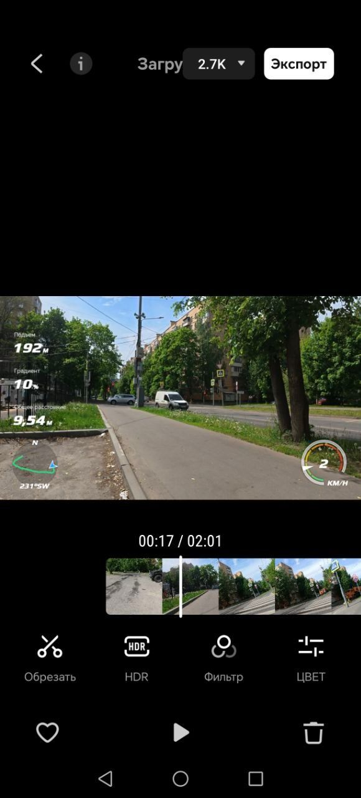
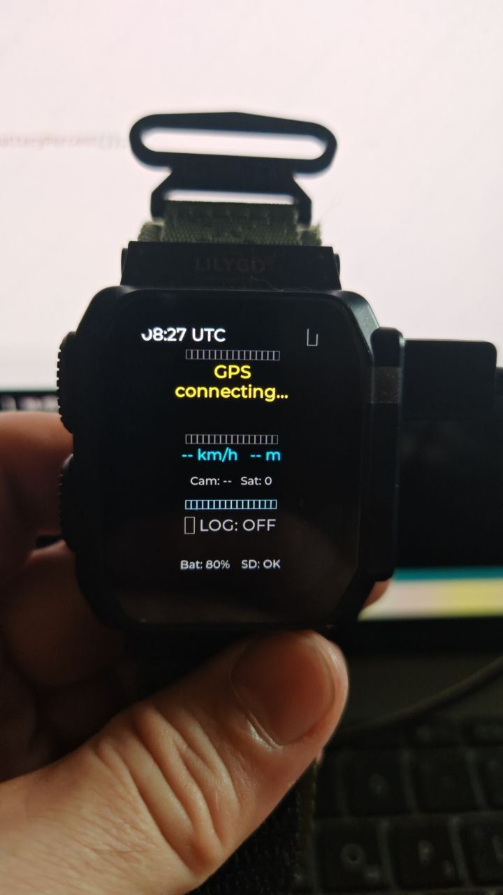

# DJI Osmo Action 5 Pro BLE Remote on LILYGO T-Watch Ultra

A custom BLE remote control for DJI Osmo Action 5 Pro built on LILYGO T-Watch Ultra (ESP32-S3). Controls camera recording, injects real-time GPS data for overlay in DJI Mimo, and logs GPX tracks to SD card — all from your wrist.

---

## ✨ Features

- **BLE Camera Control** — Start/stop recording with a tap
- **GPS Injection** — Real-time coordinates sent to camera every second, GPS overlay confirmed working in DJI Mimo
- **GPX Logger** — Track recording with waypoints (REC START/STOP, fishing spots) saved to SD card
- **Display Sleep** — Auto-off after 1 minute, wake by wrist shake
- **Two Touch Zones** — Upper 2/3 = camera control, lower 1/3 = logger control



---

## 📷 Hardware

| Component | Details |
|-----------|---------|
| **Watch** | LILYGO T-Watch Ultra (ESP32-S3R8, 240MHz, BLE 5.0) |
| **Display** | 2.01" AMOLED 410×502, CO5300 |
| **GPS** | u-blox MIA-M10Q (built-in) |
| **IMU** | BHI260AP (shake-to-wake) |
| **Battery** | 1100 mAh, IP65, ~10h runtime |
| **Camera** | DJI Osmo Action 5 Pro |
| **Camera MAC** | See `arduino/DJI_TWatch_Remote/DJI_TWatch_Remote.ino` |

---

## 🎮 Controls

```
┌─────────────────────────┐
│  08:42 UTC    ● REC     │
│                         │  ← TAP = start/stop recording
│    55.79567             │    DOUBLE TAP = connect camera
│    37.80550             │
│  5.4 km/h   230 m       │
│  Cam: OK   Sat: 8       │
├─────────────────────────┤
│  ▶ LOG: ON              │  ← LONG TAP = start/stop GPX logger
│  Bat: 94%    SD: OK     │    DOUBLE TAP = save waypoint (BITE)
└─────────────────────────┘
```

| Action | Zone | Result |
|--------|------|--------|
| Tap | Upper (2/3) | Start / Stop recording |
| Double tap | Upper (2/3) | Connect to camera |
| Long tap | Lower (1/3) | Start / Stop GPX logger |
| Double tap | Lower (1/3) | Save waypoint "BITE N" |
| Wrist shake | — | Wake display |

---

## 📡 DJI BLE Protocol

Reverse-engineered from the original [DJI-Remote](https://github.com/nicholaswilde/DJI-Remote) project (ESP-IDF).

**Frame format:**
```
[AA][LEN_LO][LEN_HI][CMD_TYPE][ENC][RES×3][SEQ_LO][SEQ_HI][CRC16×2][CMD_SET][CMD_ID][DATA][CRC32×4]
```

| Command | CMD_SET | CMD_ID | Notes |
|---------|---------|--------|-------|
| Start recording | 0x1D | 0x03 | device_id + 0x00 |
| Stop recording | 0x1D | 0x03 | device_id + 0x01 |
| GPS injection | 0x00 | 0x17 | 45 bytes struct |
| Switch mode | 0x1D | 0x04 | Video/Photo/Night/etc |

- **CRC16:** DJI Fletcher, init=0x3AA3
- **CRC32:** DJI Fletcher, init=0x00003AA3
- **BLE Service:** 0xFFF0 | Write: 0xFFF3 | Notify: 0xFFF4

---

## 📂 GPX Output

One file per day on SD card:

```
/track_2026_05_24.gpx   ← track points every minute
/log_2026_05_24.txt     ← event log with timestamps
```

**Track point:**
```xml
<trkpt lat="55.795849" lon="37.804908">
    <ele>5.0</ele>
    <time>2026-05-24T07:23:15Z</time>
    <speed>2.1</speed>
</trkpt>
```

**Waypoint (fishing spot / REC markers):**
```xml
<wpt lat="55.795849" lon="37.804908">
    <time>2026-05-24T07:23:15Z</time>
    <name>BITE 1</name>
</wpt>
```

---

## 🛠 Installation

### Requirements

- Arduino IDE 2.x
- Board: **esp32 by Espressif Systems 3.3.8**
- Board config: **LILYGO T-Watch Ultra**

### Libraries (exact versions required)

| Library | Version | Source |
|---------|---------|--------|
| LilyGoLib | 0.1.0 | [github.com/Xinyuan-LilyGO/LilyGoLib](https://github.com/Xinyuan-LilyGO/LilyGoLib) |
| SensorLib | 0.3.3 | LilyGoLib-ThirdParty ⚠️ do not update |
| RadioLib | 7.4.0 | LilyGoLib-ThirdParty ⚠️ do not update |
| lvgl | 9.4.0 | LilyGoLib-ThirdParty ⚠️ do not update |
| NimBLE-Arduino | 2.5.0 | Arduino Library Manager |
| TinyGPSPlus | built-in | Part of LilyGoLib |
| NFC-RFAL-fork | 1.0.1 | [github.com/lewisxhe/NFC-RFAL-fork](https://github.com/lewisxhe/NFC-RFAL-fork) |
| ST25R3916-fork | 1.1.0 | [github.com/lewisxhe/ST25R3916-fork](https://github.com/lewisxhe/ST25R3916-fork) |

### Flash

1. Open `arduino/DJI_TWatch_Remote/DJI_TWatch_Remote.ino` in Arduino IDE
2. Select board: **LILYGO T-Watch Ultra (SX1262)**
3. Set your camera MAC address in the sketch:
```cpp
static const char* CAMERA_MAC = "xx:xx:xx:xx:xx:xx";
```
4. Upload via COM port (auto-detected, no button press needed)

---

## 📁 Repository Structure

```
DJI-Remote/
├── arduino/
│   └── DJI_TWatch_Remote/      ← Main Arduino sketch
├── protocol/                   ← DJI BLE protocol (ESP-IDF, C)
├── ble/                        ← BLE layer
├── logic/                      ← Command logic
├── utils/crc/                  ← CRC16/CRC32 implementation
├── docs/                       ← Documentation & images
├── WORKING_LIBRARIES.md        ← Verified library versions
└── README.md
```

---

## 🔑 Key Technical Notes

- **GPS:** Use `instance.gps` (LilyGoLib), do **not** create `HardwareSerial` manually
- **BLE:** All BLE operations in a FreeRTOS task — calling `connect()` from `setup()` hangs the system
- **LVGL:** Update UI via flags from BLE task, never directly
- **Display:** 2.01" AMOLED has rounded corners — keep content 50px+ from edges

---

## 📜 Background

This project started as a fork of [DJI-Remote](https://github.com/nicholaswilde/DJI-Remote) (ESP-IDF). The protocol was reverse-engineered from that codebase. The Arduino/LilyGoLib port was built from scratch to run on the T-Watch Ultra wristwatch.

Use case: fishing from a boat — camera mounted on the boat, watch on wrist. One tap starts recording, GPS coordinates are overlaid on the video in DJI Mimo, and the route is logged as a GPX track.

---

## 📄 License

This project is licensed under the **MIT License**. See [`LICENSE`](LICENSE).

Third-party licenses (DJI, ESP-IDF, MIT legacy) are listed in [`THIRD_PARTY_NOTICES.md`](THIRD_PARTY_NOTICES.md).
