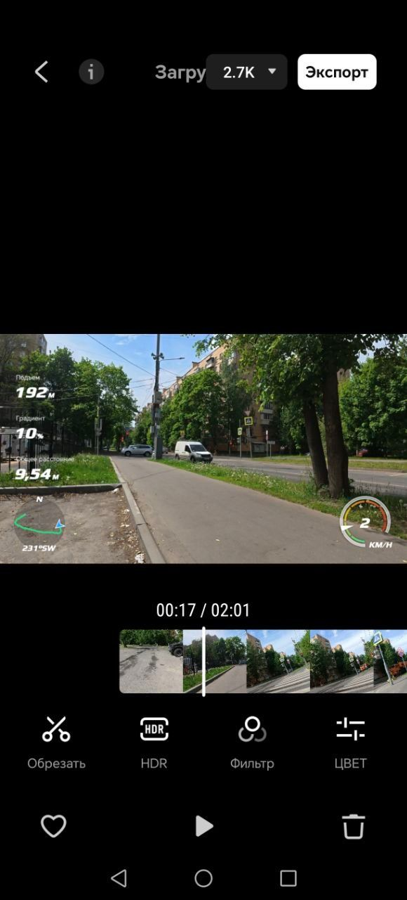
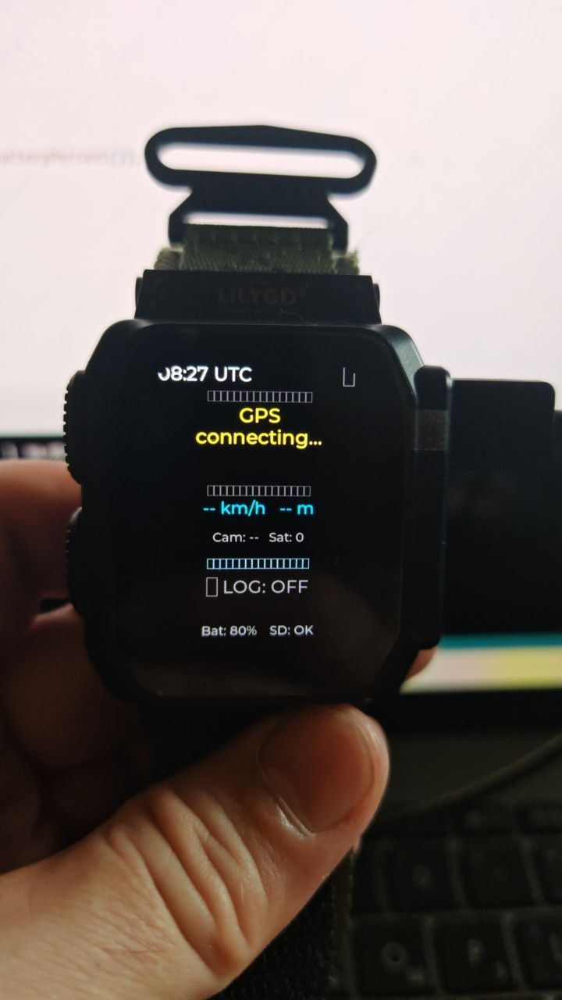

# DJI Osmo Action 5 Pro BLE Remote on LILYGO T-Watch Ultra

A custom BLE remote control for DJI Osmo Action 5 Pro built on LILYGO T-Watch Ultra (ESP32-S3). Controls camera recording, injects real-time GPS data for overlay in DJI Mimo, and logs GPX tracks to SD card — all from your wrist.

---

## ✨ Features

- **BLE Camera Control** — Start/stop recording with a tap; REC lights up only after the camera confirms the command
- **Wake a Sleeping Camera** — The camera keeps BLE alive when switched off; a tap wakes it and starts recording
- **Camera State on the Watch** — Awake / asleep / link lost, plus the camera's own battery level
- **GPS Injection** — Real-time coordinates sent to camera every second, GPS overlay confirmed working in DJI Mimo
- **GPX Logger** — One track per day (a new segment for each session) with waypoints (REC START/STOP, fishing spots); BITE marks are saved even when the logger is off
- **Display Sleep** — Auto-off after 1 minute, wake by wrist shake
- **Two Touch Zones** — Upper zone = camera control, lower zone = logger and waypoints
- **Logs over USB** — Read-only access to the SD card over the USB serial port, no need to remove the card



---

## 📷 Hardware

| Component | Details |
|-----------|---------|
| **Watch** | LILYGO T-Watch Ultra (ESP32-S3R8, 240MHz, BLE 5.0) |
| **Display** | 2.01" AMOLED 410×502, CO5300 |
| **GPS** | u-blox MIA-M10Q (built-in) |
| **IMU** | BHI260AP (shake-to-wake) |
| **Battery** | 1100 mAh, IP65, ~8 h in the field (BLE + GPS + screen) |
| **Camera** | DJI Osmo Action 5 Pro |
| **Camera MAC** | See `arduino/DJI_Remote_T-Watch/DJI_Remote_T-Watch.ino` |

---

## 🎮 Controls

```
┌─────────────────────────┐
│  08:42 UTC   [cam] REC  │
│                         │  ← TAP = start/stop recording
│    55.79567             │    DOUBLE TAP = connect camera
│    37.80550             │
│  5.4 km/h   230 m       │
│  Cam:72% GPS:||||. 8    │
├─────────────────────────┤  ← zone border (y = 318)
│  ▶ LOG: ON              │  ← HOLD 1.5 s = start/stop GPX logger
│  Bat: 94%    SD: OK     │    DOUBLE TAP = save waypoint (BITE)
└─────────────────────────┘
```

| Action | Zone | Result |
|--------|------|--------|
| Tap | Upper | Start / Stop recording (after the camera confirms) |
| Tap while `Cam:zz` | Upper | Wake the camera and start recording (~3 s) |
| Double tap | Upper | Connect to camera |
| Hold 1.5 s | Lower | Start / Stop GPX logger — buzzes while you hold, then let go |
| Double tap | Lower | Save waypoint "BITE N" (even with the logger off) |
| Tap on a dark screen / wrist shake | — | Wake display only |

**Camera status line:** `Cam:72%` awake (camera battery) · `Cam:zz` switched off / asleep, BLE link still up · `Cam:wake` being woken for REC · `Cam:--` searching · `Cam:~~` link lost, reconnecting.

**Vibration:** 1 = recording started / logger toggled · 2 = recording stopped · 3 = BITE saved · soft bump = waking the camera · long buzz = not done (camera did not confirm / not connected; for BITE — no GPS fix, date or SD).

---

## 📡 DJI BLE Protocol

Reverse-engineered from the original [DJI-Remote](https://github.com/nicholaswilde/DJI-Remote) project (ESP-IDF).

**Frame format:**
```
[AA][LEN_LO][LEN_HI][CMD_TYPE][ENC][RES×3][SEQ_LO][SEQ_HI][CRC16×2][CMD_SET][CMD_ID][DATA][CRC32×4]
```

| Command | CMD_SET | CMD_ID | Notes |
|---------|---------|--------|-------|
| Start recording | 0x1D | 0x03 | device_id + 0x00; reply `ret_code` (0 = done) |
| Stop recording | 0x1D | 0x03 | device_id + 0x01 |
| GPS injection | 0x00 | 0x17 | 48-byte layout from DJI's demo (time as UTC+8) |
| Switch mode | 0x1D | 0x04 | Video/Photo/Night/etc |
| Status subscription | 0x1D | 0x05 | push_mode=3, push_freq=20 — accepted, but status 1D02 does not arrive without the 0x00/0x19 handshake |
| Battery push (from camera) | 0x0D | 0x02 | DUML frame (SOF 0x55), 1 Hz while the camera is awake — used as a heartbeat; byte 31 = battery % |
| Wake-up | — | — | BLE advertising: manufacturer data `WKP` + camera MAC reversed, 2 s |

- **CmdType:** 0x00 no reply, 0x01 reply requested, 0x02 reply mandatory; bit 5 marks a reply frame. A reply carries the same SEQ, payload[0] = `ret_code`.
- **CRC16:** table-driven CRC-16 (0xA001 table, as CRC-16/ARC), init=0x3AA3, over bytes 0–9
- **CRC32:** table-driven CRC-32 (0xEDB88320 table), init=0x00003AA3, no final XOR
- **BLE Service:** 0xFFF0 | Write: 0xFFF3 | Notify: 0xFFF4
- Official reference: [dji-sdk/Osmo-GPS-Controller-Demo](https://github.com/dji-sdk/Osmo-GPS-Controller-Demo)

---

## 📂 GPX Output

One track file per day on SD card; every time the logger is switched on again the
same day, a new `<trkseg>` segment starts in the same file:

```
/track_2026_05_24.gpx       ← track points every minute (skipped while the GPS fix is lost)
/track_2026_05_24_wpt.gpx   ← waypoints of the day (BITE always, REC START/STOP while logging)
/log_2026_05_24.txt         ← event log with timestamps
```

Before the GPS knows the date, the logger writes `/track_session_NNN.gpx` instead.

**Track point:**
```xml
<trkpt lat="55.795849" lon="37.804908">
  <ele>5.0</ele>
  <time>2026-05-24T07:23:15Z</time>
</trkpt>
```

**Waypoint (fishing spot / REC markers):**
```xml
<wpt lat="55.795849" lon="37.804908">
  <ele>5.0</ele>
  <time>2026-05-24T07:23:15Z</time>
  <name>BITE 1</name>
</wpt>
```

Waypoints live in a separate file because the track is appended by seeking back over
its closing tags, and GPX 1.1 requires `<wpt>` before `<trk>`.

**Logs over USB:** with the watch on USB (Serial Monitor closed), send `ls` or
`cat /log_2026_05_24.txt` at 115200 baud; the file comes back between
`<<<BEGIN path size>>>` and `<<<END>>>`.

---

## 🛠 Installation

### Requirements

- Arduino IDE 2.x (or arduino-cli)
- Board: **esp32 by Espressif Systems 3.3.12** (3.3.8 used up to v2.0.0)
- Board config: **LILYGO T-Watch Ultra**

### Libraries (exact versions required)

| Library | Version | Source |
|---------|---------|--------|
| LilyGoLib | 0.1.0 | [github.com/Xinyuan-LilyGO/LilyGoLib](https://github.com/Xinyuan-LilyGO/LilyGoLib) |
| SensorLib | 0.3.3 | LilyGoLib-ThirdParty ⚠️ do not update |
| RadioLib | 7.4.0 | LilyGoLib-ThirdParty ⚠️ do not update |
| lvgl | 9.4.0 | LilyGoLib-ThirdParty ⚠️ do not update |
| NimBLE-Arduino | 2.5.0 | Arduino Library Manager |
| TinyGPSPlus | 1.1.0 | Separate library; LilyGoLib's `GPS` class derives from it |
| NFC-RFAL-fork | 1.0.1 | [github.com/lewisxhe/NFC-RFAL-fork](https://github.com/lewisxhe/NFC-RFAL-fork) |
| ST25R3916-fork | 1.1.0 | [github.com/lewisxhe/ST25R3916-fork](https://github.com/lewisxhe/ST25R3916-fork) |

### Flash

1. Open `arduino/DJI_Remote_T-Watch/DJI_Remote_T-Watch.ino` in Arduino IDE
2. Select board: **LILYGO T-Watch Ultra (SX1262)**
3. Set your camera MAC address in the sketch:
```cpp
static const char* CAMERA_MAC = "xx:xx:xx:xx:xx:xx";
```
4. Upload via COM port (auto-detected, no button press needed)

Or from the command line:
```bash
arduino-cli compile --fqbn esp32:esp32:twatch_ultra -u -p COM6 arduino/DJI_Remote_T-Watch
```

> Arduino IDE may upload stale text from an already open tab after the file was changed
> outside the IDE — reopen the sketch before uploading. After a USB upload the watch can
> take up to ~3 minutes to start; a normal power-on takes ~5 s.

---

## 📁 Repository Structure

```
DJI-Remote/
├── arduino/
│   └── DJI_Remote_T-Watch/     ← Main Arduino sketch
├── protocol/                   ← DJI BLE protocol (ESP-IDF, C)
├── ble/                        ← BLE layer
├── logic/                      ← Command logic
├── utils/crc/                  ← CRC16/CRC32 implementation
├── docs/                       ← Documentation & images
├── WORKING_LIBRARIES.md        ← Verified library versions
└── README.md
```

---

## 🔑 Key Technical Notes

- **GPS:** Use `instance.gps` (LilyGoLib), do **not** create `HardwareSerial` manually. TinyGPSPlus keeps `location.isValid()` true forever after the first fix — check `location.age()`; it also reports a zero date as valid
- **BLE:** All BLE operations in a FreeRTOS task — calling `connect()` from `setup()` hangs the system
- **Threads:** LVGL, SD and `instance.gps` only from `loop()`; camera writes only from the BLE task; other tasks log through a queue
- **Camera power:** the Osmo Action 5 Pro keeps the BLE link when switched off, so "connected" ≠ "on". Its 1 Hz battery push is the awake signal. A sleeping camera queues writes and replays them all on wake-up — never send it commands; wake it first
- **Write vs. done:** a BLE write without response only means "sent"; request a reply (CmdType 0x01) to know the camera executed it
- **Touch:** `getTouched()` only reports the IRQ flag; right after lift-off the panel raises one more IRQ without a point — count a touch only when `getPoint()` returns a point
- **Fonts:** the built-in Montserrat has only ASCII, `°`, `•` and `LV_SYMBOL_*` icons — other glyphs render as boxes
- **Display:** 2.01" AMOLED has rounded corners — keep content 50px+ from edges

---

## 📜 Background

This project started as a fork of [DJI-Remote](https://github.com/nicholaswilde/DJI-Remote) (ESP-IDF). The protocol was reverse-engineered from that codebase. The Arduino/LilyGoLib port was built from scratch to run on the T-Watch Ultra wristwatch.

Use case: fishing from a boat — camera mounted on the boat, watch on wrist. One tap starts recording, GPS coordinates are overlaid on the video in DJI Mimo, and the route is logged as a GPX track.

---

## 📄 License

This project is licensed under the [**MIT License**](https://opensource.org/licenses/MIT). See [`LICENSE`](LICENSE).

Third-party licenses (DJI, ESP-IDF, MIT legacy) are listed in [`THIRD_PARTY_NOTICES.md`](THIRD_PARTY_NOTICES.md).

## Support

If this project helped you, consider buying me a coffee ☕

**TON:** `UQC7JG7kRzsUkOZ13gul8W-CUAlob0DGQq4XBYsw9QIfaplQ`